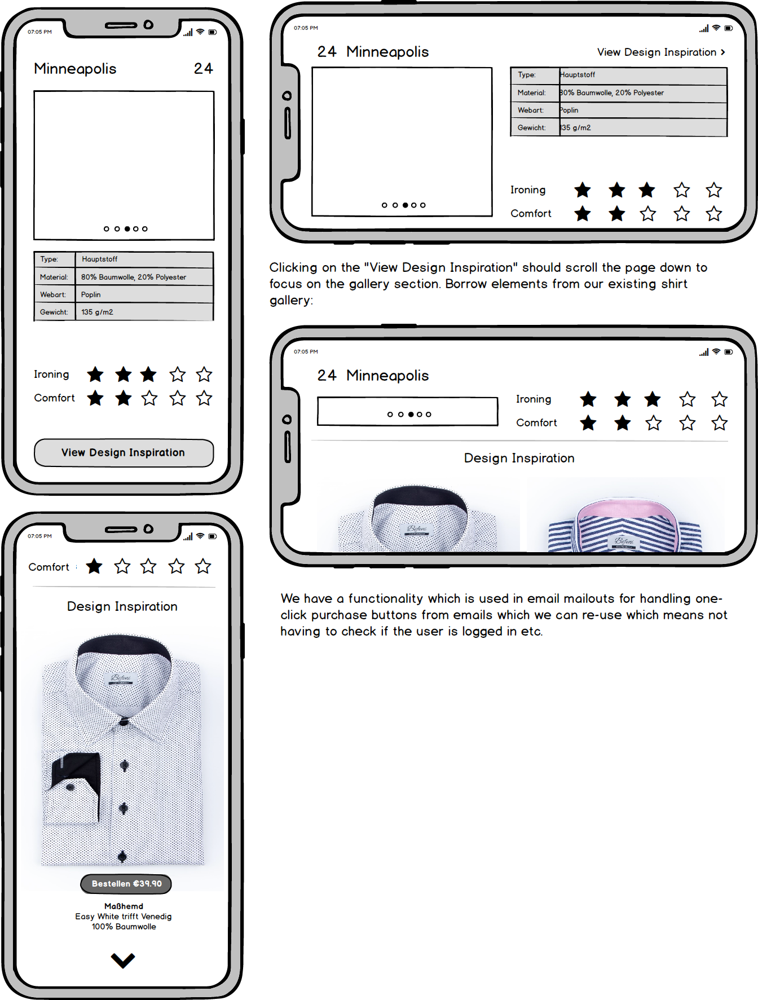

# Befeni Frontend Technical Test [Advanced]

## Test Overview

Every season, we produce a book which contains samples of our newest fabrics. Each page in the book contains the name of the fabric, a unique code for the fabric and a sample of the fabric material. 

Our sales consultants take these fabric books when they meet prospective clients so they can demonstrate the patterns and material the client can choose for their next shirt.

Unfortunately there is a lot for the consultants to learn about our fabrics - from the fiber composition to the weight and weave type. 

So our customer support teams have been been fielding demands from the consultants to create a quick-loading mobile friendly mini site that allows them to find out more details about a given fabric. 

Management has finally agreed to produce this site and the development team has been given the requirements below:

The number of hours after the requirements are an indication of the time you need to finish the task. If you need extra hours that is not a problem. The assignment is abstract on purpose.

## Requirement 1.

*Est. Time: 1-2 hours.*

You can use any frontend JS library of your choice but we exclusively use VueJS and ReactJS at Befeni. This requirement will involve creating a small frontend application that handles URLs such as

- /fabrics/22
- /fabrics/38
- /fabrics/124
- /fabrics/K10

You will need to detect the Fabric Code provided by the user in these URLs and translate it to a code that our API can understand (we use a different code for each fabric known as the `Production Fabric Code` in our backend API).

Here are a few example mappings:

| User Fabric Code | Production Fabric Code |
| ---------------- | ---------------------- |
| 22               | 10022                  |
| 38               | 10038                  |
| 124              | 10124                  |
| K10              | 30010                  |
| K5               | 30005                  |
| T500             | 20500                  |

We have provided you with a compiled version of our Typescript library in the file named `fabrics-api-library.zip` in this repository. This library interfaces with our backend API end points. You'll use this API to obtain information about the fabrics to display on the page.

**Please contact the HR team and they will provide you with an API token which you can use to authenticate yourself to our backend API.**

The requirements for the first task involve:

- Setting up the base application structure and importing our library. You should follow the best practices for your chosen library.
- On page load, you should call the authentication method using the token supplied to you.
- The application should parse the URL and determine what fabric it needs to get data for
- You should make the API call and display the data on the page (do not worry about the design for now)
- On entering a new URL, the old data should be cleanly unmounted and another API call should be made to get the new Fabric. 

## Requirement 2.

*Est. Time: 2-4 hours.*

Now we want to improve the user interface. The aim is to build an MVP so we do need to spend too much time designing the perfect user interface. The design needs to be responsive, clean and should load fast.

Please refer to the mocks below for the design of the application:

- Type: - this is whether the fabric.type = Main or Seasonal.

- Material: - this is the fabric composition label, we have a method in the API library for retrieving this on the instance of a fabric in the collection

- Webart: - this is the default weave of the fabric

- Gewicht: - this is the default weight of the fabric

- Finishing: - this is the default finish of the fabric

## Requirement 3. (Optional)

*Est. Time: 2-3 hours.*

If you used Bootstrap, the final task will be modifying the bootstrap theme SASS so that we can incorporate Befeni styling into it ala https://bootswatch.com/litera/ (take a look at their variables file).

If you decided to use another library, we want the ability to theme that library and include it into new projects in the future.

## Useful Links

- https://befeni.de/fabrics/22
- https://befeni.de/fabrics/38
- https://befeni.de/fabrics/124
- https://befeni.de/fabrics/30010
